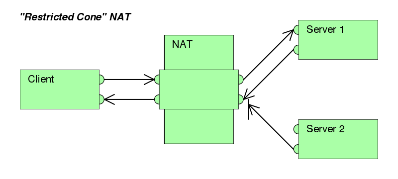
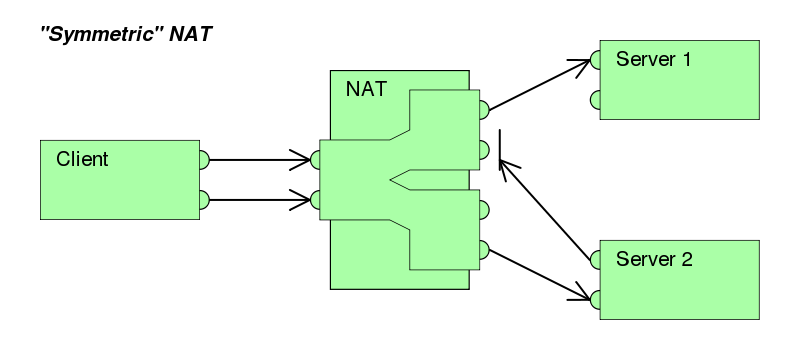

# 计算机网络_CS144_斯坦福

## Self-Reading

>   ### Engineering.Networking-SP.SelfPaced
>
>   This is the wiki for **Engineering**'s Introduction to Computer Networking : CS144
>
>   # Textbook Readings
>
>   **Page number here+27=Page number on PDF index**
>
>   Kurose, J. and Ross, K. Computer Networking: A Top-Down Approach.
>
>   -   Unit 1: 6th/7th Editions: Sections 1.1-1.3; 1.5; 2.1.
>   -   Unit 2: 6th/7th Editions: Sections 3.1-3.5.
>   -   Unit 3: 6th Edition pp. 22-31(1.3-1.3.3不读); 640-648(). 7th Edition pp. 21-43; 709-719.
>   -   Unit 4: 6th Edition pp. 259-265(3.6-3.6.2不读); 269-279(3.7TCP阻塞控制-3.7.1不读). 7th Edition pp. 261-282.
>   -   Unit 5: 6th Edition pp. 83-114(Application Layer章首-2.2.6不读). 7th Edition pp. 83-110.
>   -   Unit 6: 6th Edition pp. 305-379(Network Layer章首-4.5.3层次路由不读). 7th Edition pp. 305-348; 373-384.
>   -   Unit 7: 6th Edition pp. 433-443(Link Layer章首-5.2.3CRC不读); 461-482(5.4交换局域网-5.4.4虚拟局域网不读). 7th Edition pp. 439-449; 467-487.
>   -   Unit 8: 6th Edition pp. 671-693(Security章首-8.3.3不读). 7th Edition pp. 593-614.
>
>   # Notable Request for Comments
>
>   -   [RFC 768](https://tools.ietf.org/html/rfc768) - User Datagram Protocol (UDP)
>   -   [RFC 791](https://tools.ietf.org/html/rfc791) - Internet Protocol (IP)
>   -   [RFC 792](https://tools.ietf.org/html/rfc792) - Internet Control Message Protocol (ICMP)
>   -   [RFC 793](https://tools.ietf.org/html/rfc793) - Transmission Control Protocol (TCP)
>   -   [RFC 826](https://tools.ietf.org/html/rfc826) - An Ethernet Address Resolution Protocol (ADR)
>
>   Find more notable RFC's from [Wikipedia - List of RFCs](https://en.wikipedia.org/wiki/List_of_RFCs)
>
>   The homepage of the Internet Engineering Task Force - <https://www.ietf.org/>
>
>   View all [Official Internet Protocol Standards](https://www.rfc-editor.org/standards) here.
>
>   Wish you well!


## Unit 1: The Internet and IP

### 1-1: A Day in the Life of an Application

- 网页访问(HTTP)
  - Client-Server模型
- BT下载
  - Peer2Peer模型
  - tracker和swarm。动态交换数据
- Skype
  - Mix of these two
  - 第三方主机

### 1-2: The 4 layer Internet model  

- Application
  - 复用下面的层次
- Transport
  - TCP保证稳定传输
  - 视频通话可以用UDP，无所谓重新传
  - 包含阻塞控制
- Network
  - 负责告诉下面一层往哪里传，不管到没到
- Link
  - 以太网orWiFi，只负责传输

### 1-3: The IP service model  

- 四大性质
  - 数据报（离散数据包）
  - 不可靠（可丢包）
  - 尽力（除非必要才丢包）
  - 连接无关性（数据包可能不按顺序）
- 其他性质
  - 数据报简介（包含一些field，性质云云）

### 1-4: A day in the life of a packet

- Handshake

  - Syn

  - Syn/Ack

  - Ack

- Tools

  - Wireshark/Tshark/Traceroute

###  1-5: The Principle of Packet Switching

### 1-6: The Principle of Layering

### 1-7: The Principle of Encapsulation

### 1-8: Byte order and packet formats

Network order is Big-endian.(Same order as human write numbers.)

*The layout of a character string in memory is the same on big-endian and little-endian architectures.*

### 1-9: IPv4 addresses and CIDR

**Classes Inter-Domain Routing**

Subnet.

### 1-10: Longest prefix match (LPM)

Match the forwarding table entry or the default.

### 1-11: Address resolution protocol (ARP)

### 1-12: The Internet and IP (recap)

### 1-13: SIP -- Jon Peterson


## Unit 2: Transport

### 2-0: Transport (intro)

### 2-1: TCP service model

- 打电话——reliable
- Handshake
	- Syn-Syn/Ack-Ack
- 4 Properties
- TCP Teardown
    - $A\to B\& B\to A$: Fin-Ack
- TCP Segment Format 

### 2-2: UDP service model

- 自言自语
- 3 Properties
    - 

### 2-3: ICMP service model

- 传纸条
- Examples
	- Ping
	- Traceroute

### 2-4: End-to-end principle

- 在终端实现要实现的功能

### 2-5: Error detection

- Checksum
	- 保证检验一位错
- CRC
	- 保证检验奇数位、连续的少于CRC位数的突发错
- MAC
	- 由于key的存在，安全性高，但检错性低

### 2-6: Finite State Machines

- Boring FSM model

### 2-7: Reliable Communications - Stop and wait

- Flow control: do not **overflow the receiver**
- Only one packet on the flight

### 2-8: Reliable Communications - Sliding window

- N packets on the flight

- 连续性ACK。

	- 如收到1，2，3，5。只回复ACK3
	- 对TCP，回复要收的下一个，比如上一行回复ACK4

- Drop后处理

	- 回退N
		- 接收窗只有1位的时候，没法缓存，发送的只好全都再发一遍

- 算带宽

	```
	The total RTT(round trip time) for the flight = 200ms{50ms(A->B) + 150ms(B->A)}
	
	Net data Send( on the flight)=20*100bytes
	
	Bandwidth= Net data send/RTT= 10Kb
	```


​	

### 2-9: Reliable Communications - Retransmission strategies

- 回退N
- 选择性重复

### 2-10: Reliable Communications - TCP header

-   Seq num:starting offset of data
-   Ack num:the next byte offset of data

### 2-11: Reliable Communications - Connection setup and teardown

-   

### 2-12: Transport (recap)

讲得挺好的可以复习。

### 2-13: TCP/IP -- Kevin Fall

## Unit 3: Packet Switching

### 3-0: Packet Switching

### 3-1: The History of Networks; History of the Internet

### 3-2: What is Packet Switching?

### 3-3: Terminology, End to End Delay and Queueing Delay

- 数据包化延迟$\frac{packetSize}{linkRate}$
- 传输延迟 $\frac{length}{lightSpeed}$
- 排队等待延迟(varies)

**定义End to end delay:**

1.  从第一个bit开始被发送到最后一个bit成功被接收的时间。
2.  **不算排队等待的延迟**
3.  Store & forward:

*习题里大小不同的数据包消耗的总延迟算法不一样，不过暂时没看懂，上课再想吧。*

### 3-4: Playback Buffers

Q:Problem 3-4C
If a voice call has missing data it makes it hard to understand the speaker. Therefore, we commonly allow time for a limited number of retransmissions before playing the sound to the listener. If the network path (in each direction) has total packetization delay of 15ms, total propagation delay of 25ms, and queuing delay varying between 0ms and 10ms, how large (in milliseconds) does the playback buffer need to be if we want to allow for one retransmission?

*110ms*

Hint:The maximum RTT of the network is 100ms, so the packet can be retransmitted if a response has not been heard within 100ms.

### 3-5 Simple Deterministic Queue Model

### 3-6 Queueing Model Properties

- 突发慢

- 规矩快

- Little’s Result

$L=\lambda d$
	
$L$:等待队列长度
	
$\lambda$:输入速率
	
$d$:平均延迟
	
说人话就是：average_delay = average_occupancy / arrival_rate

- 泊松过程与M\M\1队列

*没听懂最后一个……*


​	

### 3-7: Switching and Forwarding (1)

- 输出处队列
	- 最小化数据包延迟

### 3-8: Switching and Forwarding (2)

- 输入处队列
	- 高性能
	- 结合虚拟输出处队列达到最大输出带宽

### 3-9: Rate Guarantees

- 绝对等级队列
- 权重队列

### 3-10: Delay Guarantees

### 3-11: Packet Switching (recap)

### 3-12: DC Switches -- Tom Edsall


### Reading notes

#### Scheduling Mechanisms

-   FIFO/FCFS
-   Priority Queuing-High priority queue & Low priority
-   Round Robin & WFQ(Weighted Fair Queuing)
    -   Round Robin-Polling
    -   WFQ-Serve by weight
-   The Leaky Bucket
    -   $rt+b$
        -   $r$:rate
        -   $t$:time
        -   $b$:buffer size
-   The Leaky Bucket + WFQ = Provable Maximum Delay in a Queue

$$d_{max}=\frac{b_1}{R*w_1/\sum{w_j}}$$

$d_{max}$:Max delay

$b_1$:Flow 1’s full buffer size

$R$:Transmission rate of the link in packet/sec.

$w_1$:Flow 1’s weight

$w_j$:Flow j’s weight


## Unit 4: Congestion Control

### 4-0: Congestion Control

### 4-1: Basics: what it is, time scales, fairness

### 4-2: Approaches: network vs end host, max min fairness, AIMD

- 一点点试探，一大步退却

### 4-3: Dynamics of a single AIMD flow

- 规则的锯齿

### 4-4: Multiple AIMD flow

- 服务器的buffer经常处于99%占用的状态

### 4-5: TCP Tahoe

-   Break into 3 questions
    -   When to send new data?
    -   When to retransmit?
    -   When to send ACK?
- 从微小的地方指数形式起步
- drop一个就进入放阻塞状态，试探得更慢

### 4-6: TCP RTT estimation

- 改进timeout的预计算法，得到更加精确的时间
- Self-Clocking

*跳过了一道计算题*

### 4-7: TCP Reno

**这里只记录和Tohoe不同的地方**

-   多余ACK的时候并不把congestion window变成1，而是折半。
-   timeout的时候变成1

*网课的计算题好麻烦啊……*

```
Problem 4-7A
1/1 point (graded)
Recall that TCP Reno and Tahoe differ in how they handle a triple-duplicate ACKs. Reno enters a fast retransmit state while Tahoe re-enters slow start. Suppose you have a network which supports a maximum window size of 16 packets before it starts dropping packets. On this network, you first run a TCP Tahoe flow that slow starts and observe its behaviour as it reaches steady state (where you see a repetitive pattern of congestion windows emerging).

In this steady state, what is the throughput of the TCP Tahoe flow in packets/second? Call this value “A.” Assume a constant RTT estimate of 1s, and a RTT variance estimate of 0.5s.

Now, you run a TCP Reno flow and observe its steady state behaviour. What is its throughput in packets/second (call it “B”), assuming the same RTT and variance estimates as above?

Now that you’ve computed A and B, what is the value of B/A? Assume ACKs never get lost, cwnd/ssthresh are always integers, and queueing delays are negligible.


~0.51
~1
~1.18 correct
~1.52
~1.3
Explanation

Explanation: In steady state, TCP Tahoe will have a ssthresh of 8 packets. So, you have a SS phase that transmits 1+2+4+8 packets lasting 4s, and then a CA phase transmitting 9+...+16+16*+16 (the 17th packet is the round marked * is dropped) lasting 10s. Since you get a triple duplicate ACK, you enter slow start, setting ssthresh=17/2 = 8, after which the behaviour repeats. So, you transmit 15+100+16+16=147 packets every 14s, which is 10.5 packets/sec.

In steady state, TCP Reno will have also a ssthresh of 8 packets, but it always stays in CA phase. In the CA phase, you always transmit 8+9+...+16+16*+16=140 packets which lasts 11s.

The train of packets in the 10th second triggers a triple-duplicate ACK in the 11th second, and you immediately retransmit the packet in the 12th second. Then, during fast recovery, the congestion window is set to cwnd / 2 = 17 / 2 = 8. For each of the 17 duplicate ACKs (one ACK from the last packet sucessfully received in the 16* window, and an additional 16 from the packets received in the following window), cwnd is increased by one. A packet is sent once cwnd grows to 18; another is sent once cwnd grows to 19; and so on until cwnd grows to 8 + 17 = 25. Thus, a total of 1 + (25 - 18 + 1) = 9 packets are sent in the 12th second. This whole sequence repeats from the 13th second. The throughput in this case is 149/12=12.42 packets/sec.

Thus, B/A ~ 1.18.
```

### Appendix

说人话解决TCP的历史协议。

来自Wiki：

>   TCP使用多种拥塞控制策略来避免雪崩式拥塞。TCP会为每条连接维护一个“拥塞窗口”来限制可能在端对端间传输的未确认分组总数量。这类似TCP流量控制机制中使用的滑动窗口。TCP在一个连接初始化或超时后使用一种“慢启动”机制来增加拥塞窗口的大小。它的起始值一般为最大分段大小（Maximum segment size，MSS）的两倍，虽然名为“慢启动”，初始值也相当低，但其增长极快：当每个分段得到确认时，拥塞窗口会增加一个MSS，使得在每次往返时间（round-trip time，RTT）内拥塞窗口能高效地双倍增长。
>
>   当拥塞窗口超过慢启动阈值（ssthresh）时，算法就会进入一个名为“拥塞避免”的阶段。在拥塞避免阶段，只要未收到重复确认，拥塞窗口则在每次往返时间内线性增加一个MSS大小。

对于处理报文丢失这个事件上，不同拥塞控制算法表现有所不同：


>   对于TCP Tahoe算法，当发生丢失时，会进入“快速重传”机制，慢启动阈值设为之前拥塞窗口值的一半，拥塞窗口值降为初始值，重新进入慢启动阶段。当拥塞窗口值达到慢启动阈值时，每RTT内拥塞窗口增加值则为“MSS除以CWND”的值，所以拥塞窗口按线性速度增加。
>   TCP Reno算法实现了一个名为“快速恢复”的机制，慢启动阈值设为之前拥塞窗口值的一半，和作为新的拥塞窗口值，并跳过慢启动阶段，直接进入拥塞控制阶段。

**快速重传**
快速重传（Fast retransmit）是对TCP发送方降低等待重发丢失分段用时的一种改进。TCP发送方在每发送一个分段时会启动一个超时计时器，如果相应的分段确认没在特定时间内被送回，发送方就假设这个分段在网络上丢失了，需要重发。这也是TCP用来估计RTT的测量方法。

重复确认（duplicate cumulative acknowledgements，DupAcks）就是这个阶段的基础，其基于以下过程：如果接收方接收到一个数据分段，就会将该分段的序列号加上数据字节长的值，作为分段确认的确认号，发送回发送方，表示期望发送方发送下一个序列号的分段。但是如果接收方提前收到更下一个序列号的分段——或者说接收到无序到达的分段，即之前期望确认号对应的分段出现接收丢失——接收方需要立即使用之前的确认号发送分段确认。此时如果发送方收到接收方相同确认号的分段确认超过1次，并且该对应序列号的分段超时计时器仍没超时的话，则这就是出现重复确认，需要进入快速重传。

快送重传就是基于以下机制：如果假设重复阈值为3，当发送方收到4次相同确认号的分段确认（第1次收到确认期望序列号，加3次重复的期望序列号确认）时，则可以认为继续发送更高序列号的分段将会被接受方丢弃，而且会无法有序送达。发送方应该忽略超时计时器的等待重发，立即重发重复分段确认中确认号对应序列号的分段。

**TCP Tahoe & TCP Reno具体实现算法**

>   两者算法大致一致，对于丢包事件判断都是以重传超时（retransmission timeout，RTO）和重复确认为条件，但是对于重复确认的处理，两者有所不同：
>
>   Tahoe：如果收到三次重复确认——即第四次收到相同确认号的分段确认，并且分段对应包无负载分段和无改变接收窗口——的话，Tahoe算法则进入快速重传，将慢启动阈值改为当前拥塞窗口的一半，将拥塞窗口降为1个MSS，并重新进入慢启动阶段。[15]
>   Reno：如果收到三次重复确认，Reno算法则进入快速重传，只将拥塞窗口减半来跳过慢启动阶段，将慢启动阈值设为当前新的拥塞窗口值，进入一个称为“快速恢复”的新设计阶段。
>   对于RTO，两个算法都是将拥塞窗口降为1个MSS，然后进入慢启动阶段。[15]
>
>   快速恢复
>   快速恢复（Fast recovery）是Reno算法新引入的一个阶段，在将丢失的分段重传后，启动一个超时定时器，并等待该丢失分段包的分段确认后，再进入拥塞控制阶段。如果仍然超时，则回到慢启动阶段。

从JAVA Applet观察，[TCP-Congestion](https://media.pearsoncmg.com/aw/ecs_kurose_compnetwork_7/cw/content/interactiveanimations/tcp-congestion/index.html)

|         | Tahoe                                                        | Reno                   |
| ------- | ------------------------------------------------------------ | ---------------------- |
| 3 Ack’s | Set window to 1, exponential rise to ssthresh, congestion avoidance. | *Half the window size. |
| Timeout | Same as above.                                               | Same as left-above.    |


### 4-8: Why AIMD

-   Chiu Jain Plot
    -   维持了用户间的平衡
        -   送数据包多的那个half的时候window size掉的也多
        -   最终接近Fair与Payload的平衡

### 4-9: Reading an RFC

### 4-10: Congestion control

### 4-11: Shortcomings and improvements of TCP and congestion control -- Nandita Dukkipati


### Reading notes

ABR-Available bit-rate.

ATM-Asynchronous transfer-mode.


## Midterm


## Unit 5: Applications and NATs

### 5-0: Applications and NATs

NAT->DNS->HTTP

### 5-1: Network Address Translation

What NAT does: translate internal/external ip address.

Nice advantages:security

Example: rewrite ip address & port number

Problem:

```python
问题5-1A
1/1点（分级）
假设所有32位IPv4地址空间都可用于公共地址分配，除了为NAT后面的私有地址保留的10.0.0.0/8范围。（没有其他保留，多播或特殊用途地址。）只有一个NAT，我们在整个网络中可以拥有的最大总主机数是多少（不包括NAT）？

(2**32-2**24)+(2**24-1)=4294967295
 
提示：考虑没有10.0.0.0/8的IPv4地址空间中有多少个地址。

不要忘记删除NAT的公共地址。
```

### 5-2: NATs - Types

-   **完全圆锥型NAT** Full Cone NAT
    -   regardless of IP, translate between port pairs
    -   一旦一个内部地址（iAddr:port）映射到外部地址（eAddr:port），所有发自iAddr:port的包都经由eAddr:port向外发送。任意外部主机都能通过给eAddr:port发包到达iAddr:port（注：port不需要一样）
-   **受限圆锥型NAT** Address-Restricted cone NAT
    -   内部客户端必须首先发送数据包到对方（IP=X.X.X.X），然后才能接收来自X.X.X.X的数据包。在限制方面，唯一的要求是数据包是来自X.X.X.X。
    -   内部地址（iAddr:port1）映射到外部地址（eAddr:port2），所有发自iAddr:port1的包都经由eAddr:port2向外发送。外部主机（hostAddr:any）能通过给eAddr:port2发包到达iAddr:port1。（注：any指外部主机源端口不受限制，但是目的端口必须是port2。只有外部主机数据包的目的IP 为 内部客户端的ip，且目的端口为port2时数据包才被放行。）
-   **端口受限圆锥型NAT ** Port-Restricted cone NAT
    -   类似受限制锥形NAT（**Restricted cone NAT**），但是还有端口限制。
    -   一旦一个内部地址（iAddr:port1）映射到外部地址（eAddr:port2），所有发自iAddr:port1的包都经由eAddr:port2向外发送。
    -   **在受限圆锥型NAT**基础上增加了外部主机源端口必须是固定的。
-   对称NAT Symmetric NAT
    -   每一个来自相同内部IP与端口，到一个特定目的地地址和端口的请求，都映射到一个独特的外部IP地址和端口。
    -   只有曾经收到过内部主机数据的外部主机，才能够把封包发回







### 5-3: NATs - Implications

#### Hole-punching

> **打孔**（或有时**打孔**）是[计算机网络中](https://www.wikiwand.com/en/Computer_networking)用于在两方之间建立直接连接的技术，其中一方或两方都在[防火墙](https://www.wikiwand.com/en/Firewall_(networking))后面或在使用[网络地址转换](https://www.wikiwand.com/en/Network_address_translation)（NAT）的[路由器](https://www.wikiwand.com/en/Router_(computing))后面。要打孔，每个客户端都连接到一个不受限制的第三方服务器，该服务器临时存储外部和内部[地址](https://www.wikiwand.com/en/Network_address)和[端口](https://www.wikiwand.com/en/Port_(computer_networking))每个客户的信息。然后，服务器将每个客户端的信息中继到另一个客户端，并使用该信息，每个客户端尝试建立直接连接; 由于使用有效端口号的连接，限制性防火墙或路由器接受并转发每侧的传入数据包。

#### NAT给现代互联网带来的影响

互联网的新沙漏：在IP层之上只有ICMP、TCP、UDP三层，其他因为无法被NAT广泛支持，所以逐渐不用了。

### 5-4: NATs - Operation

当NAT收到一个抵达未使用过的port的包时，NAT表现得就像一个普通的IP设备。如80端口的网页管理界面。

带读RFC。

### 5-5: HTTP

-   定义
    -   超文本标记语言
-   Request format
-   Delay for web page

### 5-6: HTTP/1.1 Keep-alive Header

#### A cornerstone(基石) on interent’s history


### 5-6: HTTP/1.1 Keep-alive

### 5-7: BitTorrent

### 5-8: DNS 1

-   Hierarchical architecture
-   2 types of queries
    -   Recursive
    -   Nonrecursive

### 5-9: DNS 2


### 5-10: DNS 3

### 5-11: DHCP

### 5-12: Applications and NATs (recap)

## Unit 6: Routing

### 6-0: Routing

### 6-1: Flooding, source routing and spanning trees

在不清楚拓扑时，Flooding是有用的。

在相对静态的环境下，source routing还不错，但是overhead较大。


### 6-2: Bellman Ford

对应NJU和课本说的DV算法。Basics of RIP & BGP.

Max run time: ~The length of the longest loop free path in the graph

Convergence

### 6-3: Dijkstra

对应LS算法。Basics of OSPF.

Max run time: n routes -> n iteration

When something changed: compute everything from scratch

*结尾的视频演示太强了！*

### 6-4: Internet (RIP, OSPF) AS's


### 6-5: BGP

### 6-6: Multicast

### 6-7: Spanning Tree

### 6-8: IPv6

### 6-9: Routing

### 6-10: Routing Today -- David Ward

### 6-11: BGP Past, Present and Future -- Jennifer Rexford

## Unit 7: Lower Layers

### 7-0: Lower Layers

### 7-1: Shannon Capacity and Modulation

**Shannon Capacity**

$Capacity=Bandwidth*\log_2(1+\frac{SignalStrenth}{Noise})$

It’s the upper bound of capacity.


**Analog signals**

1. ASK-调幅
2. FSK-调频
3. (B\Q)PSK-调相位
4. QAM-同时调幅度和频率


**IQ modulation**-IQ调制

### 7-2: Bit Errors

Coding Gain-The 2th/1st layer bits ratio.

Caused by redundancy,which is a must.


```
问题7-2C
考虑64-QAM调制的简化形式，其支持150 Mbps的比特率。假设它使用5/6的编码增益，它每秒在线上放多少个符号（以百万计）？
30
```

说明：每个符号的位数为64-QAM = log2（64）= 6.由于bitrate = bits / symbol $$ \times $$符号率$$ \times $$编码增益，符号率= $$ {150 Mbps \times {6\over 5}\over 6} $$ =每秒3000万个符号。

### 7-3: Clocks

*并不在NJU课程的范围内，暂时跳过。*

一般有Start和End的特殊模式信号使得收发两方同步。

```
问题7-3A
红外遥控器使用异步通信使用1MHz时钟发送64位数据。两端的时钟相差最多10kHz。以下哪项陈述属实？


如果接收器的时钟比发送器的时钟慢10kHz，那么我们将计算两次。
如果接收器的时钟比发送器的时钟快10kHz，那么我们将计算两次。 正确
没有风险我们会错过一点，或者计算两次。
如果我们将发送的数据量增加一倍，我们将保证可靠地交付。

说明
b是真的，因为我们将在0.5 / 1％= 50bit次之后加倍计数。

提示：
10kHz是1MHz的1％。
1％= 10,000 ppm
```

[回头做练习](https://lagunita.stanford.edu/courses/Engineering/Networking-SP/SelfPaced/courseware/8470e3e5702245579e28e508065118ee/9eeab06036284fa981e748afe5963914/?child=first)

### 7-4: FEC and Reed-Solomon

*并不在NJU课程的范围内，暂时跳过。*

### 7-5: MAC and CSMA/CD

$\frac{PacketSize}{RateOfLink} \geq 2\times \frac{LengthOfLink}{SpeedOfLight}$

课程答题到这。

### 7-6: Ethernet

Hubs & Switches


### 7-7: Wireless is Different

### 7-8: MAC

### 7-9: CSMA/CA

### 7-10: RTS/CTS

Got here.

### 7-11: WiFi

### 7-12: IP Fragmentation

### 7-13: Lower Layers (recap)

### 7-14: Cloud Managed Wifi -- Sanjit Biswas

## Unit 8: Security

### 8-0: Security

### 8-1: Introduction to Network Attacks

### 8-2: Layer 2 Attacks

### 8-2a: Demo: MAC Overflow Attack

### 8-2b: Demo: DHCP/DNS Masquearade Attack

### 8-3: Layer 3 Attacks

### 8-4: Denial of Service

### 8-5: Security Principles

### 8-6: Confidentiality

### 8-7: Integrity

### 8-8: Public Key Cryptography

### 8-9: Certificates

### 8-10: TLS

### 8-11: Security

### 8-12: Security and Openess -- Reed Hunt

### 8-13: Security -- Dan Boneh


