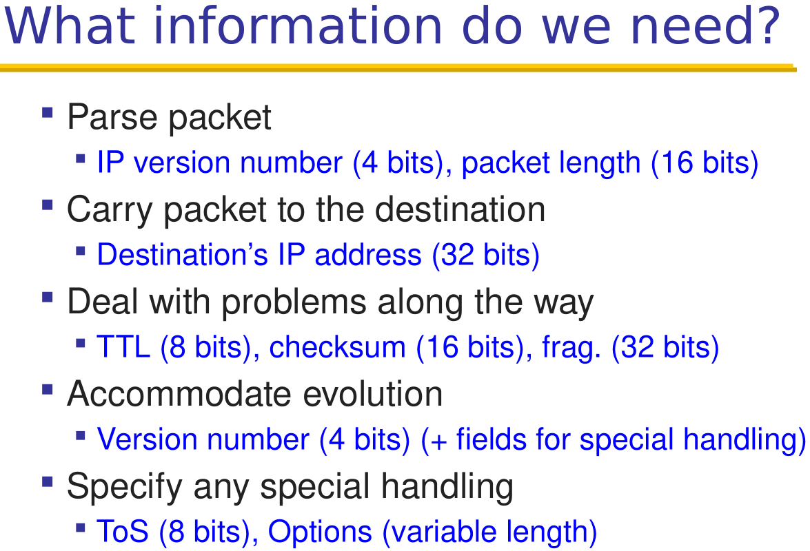

# ComputerNetwork_NJU

# 复习指南

1. 听一边最后的录音。跟着review PPT看Slides，整理Notes。
2. 挑不会的部分，刚刚看懂的部分做一下课后习题确认自己会了。
3. 看看对应的作业题。
4. 对着隔壁班的复习提纲再看一遍Slides

# Basics

## Switched network

### Circuit switching

-   Multiplexing
    -   **Time** division multiplexing
    -   **Frequency** division multiplexing
    -   Both
-   Timing in circuit switching
    -   **Delay**-May lack of resources
-   Pros
    -   **Predictable** performance
    -   **Simple/fast** (once established)
-   Cons
    -   Complexity of **setup/tear down**
    -   **Inefficient** when traffic is **bursty**
    -   **Delay** on setup
    -   …

### Packet switching/统计性交换

-   统计——在大多数情况下各用户的突发需求合计不超过交换机处理能力
-   Pros
-   Cons


## Performance

### Delay

-   Four components
    -   Transmission(Due to link properties)
        -   对应数据包化延迟
        -   Packet size/Rate of link
        -   数据包大小/链路传输率
    -   Propagation(Due to link properties)
        -   Link length/Speed of link
        -   大概是链路长度/0.66*光速
    -   Queuing(Due to traffic mix & switch internals)
        -   Queuing theory 
            -   Average rate A
            -   Peak rate P
            -   Waiting time W
        -   对应Little‘s Result
            -   LengthOfQueue=AverageRate$\times$WaitingTime
    -   Processing(Due to traffic mix & switch internals)
        -   现代交换机为$ns$级，可忽略
-   Bandwidth-Delay Product
    -   Bandwidth * Propagation delay
    -   Represents the amout of data in flight

TBD:Pic on PDF 51

### Loss

### Throughput

## 

## Laying & Encapsulation

### pros & cons 

# End of Basics

## Q:

1. Link characteristics??

## More to read text:

1. 虚拟链路？

# Link layer

## Shared/broadcastsolution

### Partition

TDMA/FDMA/[CDMA](https://www.wikiwand.com/zh-hans/%E5%88%86%E7%A2%BC%E5%A4%9A%E9%87%8D%E9%80%B2%E6%8E%A5)

### Random

- Aloha/Slotted-Aloha:
  - successful ratio
    - See textbook(Chinese ver.) P295-P297
- Ethernet, CSMA/CD-need to ensure the latency is low enough
  - CSMA-载波监听，说话前听听有人讲话嘛w
  - CD-冲突检测
  - Ethernet最短包长度64Bytes。如果太短，会在没有监听到的情况下发包，反而不知道自己的包被干涉。
  - sender needs at least 2$\times$ latency for transfering data
  - Min frame size
  - Max length of the wire
- Wireless
  - **Random**:CSMA/CA & Distributed Coordination
    - Request to Send (RTS)-Clear to Send (CTS)-data-ACK
  - Hidden terminal
    - A, C can not hear each other. Hence, A, C are unawarA, C are unaware of their interference at B
  - Multi-path
    - Signals bounce off surface and interfere with
      one another
    - Self-interference

### Taking turns

- Token passing

## Switched solution

*Nowadays the way Ethernet works.*

### Switch/Bridge

- Self learning of switch
- Spanning tree approach to avoid loop


Lan & Wlan

无线网络的模式

- 基站模式
- 无基站模式（ad-hoc）


单跳与多跳

多径效应

CSMA/CA


### Units

$M:10^6$

$G:10^9$

$ms:10^{-3}s$

# End of Link layer

## Q


1. CSMA/CD
   1. Min Frame Size & Max Link Length? $\frac{PacketSize}{RateOfLink} \geq 2\times \frac{LengthOfLink}{SpeedOfLight}$
2. Wireless
   1. CSMA/CA??

## More to read text:

1. Distributed Coordination

# Network layer

## IP Header

-   构成
-   
-   
-   

## Link-state v.s. Distance Vector

-   Dijkstra(LS-OSPF) and BF(DV-RIP)?
-   

## Intra- and inter-domain routing(对应路由算法)

### RIP(DV)

### OSPF(LS)

### BGP(DV)

#### Why

-   policy
    -   Business relationships
-   autonomy
-   privacy

#### 4 attrs differ from DV

-   Not picking shortest-path routes, BGP selects the best route based on policy
-   Path-Vector routing, but why???
    -   **Loop avoidance** is straightforward (simply discard paths with loops)
    -   Flexible and expressive **policies based on entire path**
-   Selective route advertisement
    -   For policy reasons, an AS may choose not to advertise a route to a destination 
-   BGP may aggregate routes

#### Protocol details

4 attrs in BGP route

1.  ASPATH
    1.  Vector that lists all the ASes a route 
        advertisement has traversed (in reverse order)
2.   Local preference in choosing between different AS paths(carried only in iBGP messages)
    1.  The higher the value the more preferred
3.  Multi-exit discriminator (kind like for breaking ties)
    1.  specifies how close a prefix is to the link it is 
        announced on
    2.  Lower is better
4.  IGP cost for hot-potato routing
    1.  Each router selects the closest egress point based on the path cost in intra-domain protocol


#### Issues in practice

-   Reachability
    -   In normal routing, if graph is connected then 
        reachability is assured. With policy routing, this does not always hold
-   Security
    -    AS may forward packets along a route different 
        from what is advertised
-   Convergence
    -    If all AS policies follow “Gao-Rexford” rules, 
        BGP is guaranteed to converge. For arbitrary policies, BGP may fail to 
        converge!
    -   (Gao-Rex rule)
-   Performance
    -   Not always optimal due to policy
    -   AS path length can be misleading
    -   Slow convergence
-   Anomalies

## Other topics

-   Subnet, netmask, gateway etc.
-   CIDR
    -   More general question
-   ARP
-   DHCP

# End of network layer

## Q

1.  BF，毒性逆转为什么不能应对3个以上的节点？
    1.  见第七版课本P11

## More to read

#  Transport layer

## PPT4.1 TCP basic

1. Stop & wait: OK with short distance. Thoughput ~ Data/RTT.
2. Sliding window(with buffer). 
3. Cumilative/Selective ACK
4. GBN(Used in data center
5. Selective Repeat(Compare in screenshot)

## UDP&[TCP](https://tools.ietf.org/pdf/rfc793.pdf)

### UDP vs. TCP

-   区别，可靠与简单的权衡
-   UDP is a minimalist transport protocol
    -    Only provides mux/demux capabilities
-   TCP delivers a reliable, in-order, byte stream

### UDP/TCP Header

-   
-   
    
-   Note:*While computing the checksum, the checksum field itself is replaced with zeros.*
    
-   >   TCP-Checksum:  16 bits
    >
    >   ​    The checksum field is the 16 bit one’s complement of the one’s complement sum of all 16 bit words in the header and text.  
>
    >   *If a segment contains an odd number of header and text octets to be checksummed, the last octet is padded on the right with zeros to form a 16 bit word for checksum purposes.  The pad is not transmitted as part of the segment.*  
    >
    >   While computing the checksum, the checksum field itself is replaced with zeros. The checksum also covers a 96 bit pseudo header conceptually prefixed to the TCP header.  This pseudo header contains the Source Address, the Destination Address, the Protocol, and TCP length. This gives the TCP protection against misrouted segments.  This information is carried in the Internet Protocol and is transferred across the TCP/Network interface in the arguments or results of calls by the TCP on the IP.

```c
+--------+--------+--------+--------+
|           Source Address          |
+--------+--------+--------+--------+
|         Destination Address       |
+--------+--------+--------+--------+
|  zero  |  PTCL  |  TCP Length     |
+--------+--------+--------+--------+
```

### Reliable transmit

- Two common options of ACK:
  - Cumulative ACKs: ACK carries next in-order 
    sequence number the receiver expects
  - Selective ACKs: ACK individually acknowledges 
    correctly received packets
- Resending packets: two canonical approaches
  - Go-Back-N: 
    - Better when error rate is low; wastes bandwidth otherwise
  - Selective Repeat
    - Better when error rate is high; otherwise, too complex

### TCP setup & break-down

-   为什么要三次握手，四次挥手

-   两种break-down的方式

-   MaxSegSize+IPhdr+TCPhdr=MTU

    esitimateRTT:K/P algorithm(see screenshot)

### TCP details: reliability and flow control 

-   Seq & Ack

    -   Sequence number:1 st byte in segment
    -   ACK sequence number: next expected byte
    -   Seqno of next packet is **same as** last ACK field
    -   **Duplicate** ACKs are a *sign of an isolated loss*
    -   Timer
-   TCP的抽象(stream)和UDP的抽象有什么区别
    -   TCP抽象成带连接的数据流，UDP抽象成无连接的数据包
-   RTT&e-RTT
    -   见课本公式，第七版P158-P159

## TCP congestion control

### FSM sum up

**见课本第七版P179，总结得不错。**

1.  Timeouts $\to$Slow start
2.  dupACKs$\to$Fast Recovery
3.  New ACK change state only from Fast Recovery

### Throughput

-   Textbook: $0.75\times\frac{WindowWhenDropPacket}{RoundTripTime}$
-   Slide: Let $RTT=\frac{W_{max}}{2}$,then $A=\frac{3}{8}W_{max}^2$
    -   Packet drop rate: $p=\frac{1}{A}$
    -   Throughput: $B=\sqrt{\frac{3}{2}}\times \frac{1}{RTT\sqrt{p}}$

### TCP flow&congestion control

- flow control-don’t overflow the receiver & congestion control- don’t overflow the network

#### TCP flow control

min{CWND(Router),RWND(Reciever)}=SenderSideWindows

Slow start->(ssthresh)->AIMD->Why AIMD(Theory)

Summary(Screenshot)

#### TCP congestion control

7 implications/problems for TCP congestion control

1. 不同RTT有不公平的吞吐量（见Throughput计算。Lower RTT, higher throughput）
2. 需要多条TCP链接使高速Link占满（因为Throughput 与丢包率有关）
3. 新变种：RateBasedTCPCongestionControl-用方程计算，更加稳定，对流媒体应用友好。
4. 存在不是因为拥塞而造成的包丢失
5. 对于短流，不适用。他们甚至没有达到ssthresh。课本给出了TCP split的解决方案。
6. 短流也要参与Buffer里的排队
7. 很容易Cheat
    1. AI时更快
    2. 初始化CWND为一个大数
    3. 同时打开多条连接
8. 拥塞控制与可靠性缠绕在了一起，有时候我们只需要其中一个。

## ICMP

-   Applications

## NAT

-   地址换地址
-   端口换地址
-   静态绑定&动态绑定

# End of Transport layer

## Q

1. Fast revocery???

## More to read 

1. TCP all!!

# Application layer

-   HTTP
    -   有哪些种类，取数据的方式有什么不同
        -   1.0
        -   1.1
        -   2.0
    -   给出网页的组成计算花费时间和建立连接数等
    -   HTTP有哪些操作
    -   Different versions with different fetch strategies
-   DNS
    -   Two operational modes
-   CDN

NAT->DNS->HTTP

## HTTP

- History
- Components
  - URL定位内容
    - 文件
    - 函数
  - HTTP表达内容
    - 用HTTP1.1举例

HTTP1.1

1. 使用明文表示动作，如GET\RESPONSE
2. stateless->Cookies
3. Performance
   1. Indepently
   2. Persistantly
   3. Pipeline over same connection
   4. Parallel connection
   5. Caching
      1. How
      2. Where
         1. Client
         2. Forward proxy
         3. Reverse proxy


# Security

-   Symmetric keys
    -   DH key exchange
-   Public-private keys
    -   How to calculate?
    -   给出一部分输入能否把pq都推出来？
-   Trusted 3rd Party
    -   定义？
    -   重要性？
-   IPSec
    -    两种协议模式
    -   两种运行模式
        -    低级：认证
        -    高级：认证+加密
-   SSL/TLS


# Final review

-   闭卷
-   不用手写程序
-   可带计算器
-   可能有OfficeHour
-   范围内大概率会考，PPT出现的都可能会考
-   8个问题

# Homework

| *Deadline* | *Homework*                                                   |
| ---------- | ------------------------------------------------------------ |
| *Mar 21*   | *Introduction: (Textbook Charpter 1: R12, R23, R24, R25)*    |
| *Apr 4*    | *Direct Link Networks: (Textbook Charpter 5: R4, R5, R6, R8, P3, P5, P6, P8, P10, P18, P19, P23, P24, P25, P26) (Textbook Charpter 6: R7, P5, P6, P8)* |
| *Apr 18*   | *Packet Switching Networks (Textbook Charpter 4: R1, R2, R21, P1, P2, P26, P28, P30, P34)* |
| *May 2*    | *Internetworking (Text book Charpter 4: R14, R16, R19, R20, R23, R29, R35, R36, P13, P17, P22, P35, P37, P45)* |
| *May 16*   | *End-to-End Protocols (Textbook Charpter 3: R5, R8, R14, P1, P19, P27, P32, P40, P50, P52)* |
| *May 30*   | *Congestion Control and QoS (Textbook Charpter 7: R19, P1, P3, P5, P18, P20)* |
| *Jun 13*   | *Network Security (Textbook Charpter 8: R5, R6, R15, R23, P3, P7, P8, P9, P16, P18, P19)* |