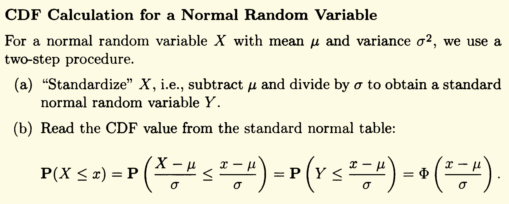
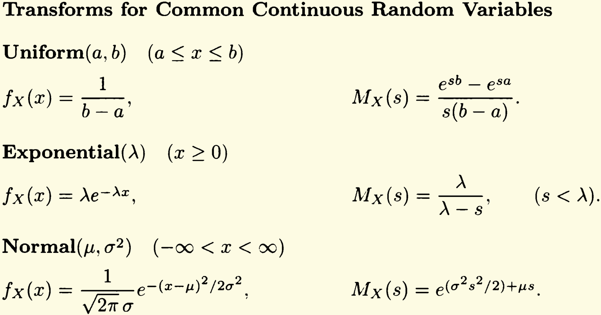

# MIT 6.041 Probability

# Sample Space & Probability

## Sets

-   Set operation

## Probabilistic Models

PM consists of:

-   Sample space
-   Probability law

Sequential Models.

### 3 Probability Axioms

1.  Non-negativity
2.  Additivity
3.  Normalization

Discrete Uniform Probability Law->古典概型。

Continuous Models->几何概型。

P14 textbook, Some Prop. s of Probability Laws.

## Conditional Probability

### Multiplication Rule

## Total Probability Theorem & Bayes’ Rule

## Independence

### Conditional Independence

Def:

1.  $$P(A\cap B|C)=P(A|C)P(B|C)$$
2.  $$P(A|B\cap C)=P(A|C)$$

Prop:

- On Venn Graph:$Disjoint \to Dependent$

  - If A happens, B won’t

- Pairwise independence **does not** imply independence.

  

### Binomial formula

即二项分布，伯努利分布

## Counting

1.  乘法法则
2.  k-permutations->n元素取k元素排列
3.  Combinations
4.  Partitions(Multinomial coefficient)->由多次Combination导出

## Summary

Three methods for calculating probabilities:

1.  Counting. Using Discrete Uniform Probability Law.
2.  Sequential. Using Multiplication rule.
3.  Divide & conquer. Using Total probability theorem.

## Problems

# Discrete Random Variables

## Words

Tetrahedral，四面体。

## Basic Concepts

Def. of Random Variables-A real-valued function of the experimental outcome.

## Probability Mass Functions

**概率分布函数**

定义了计算方式

### 几种典型的随机变量及其均值方差

#### The Bernoulli Random Variable

**01分布/伯努利分布**

一次实验，p概率成功，1-p概率失败。

#### The Binomial Random Variable

**二项分布**

组合数加上概率的乘法法则导出。

#### The Geometric Random Variable

**几何分布**

Memoryless property->无记忆性，给定X>2时 r.v. X-2有着一样的PMF。

#### The Poisson Random Variable

**泊松分布**

*在$\lambda = np$且n很大p很小时可做近似计算。*

## Functions of Random Variables

主要讨论随机变量函数的期望/均值和方差。

- Expected Value Rule of r.v. Func: 
  - $E[g(X)]=\Sigma_xg(x)p_X(x)$

*好处在于不用计算$g(X)$的PMF。*Lec5的Slides倒数第二张说明实际上是在不同的Sample Space进行计算。

- Mean and Variance of Linear Func:
  - 令$Y=aX+b$，则$E[Y]...$,$Var(Y)...$

## Expectation, Mean & Variance

### Prop. s of expectation

线性性：

1.  $E(\alpha X+ \beta)=\alpha E(X)+ \beta$
2.  $E(X+Y+Z)=E(X)+E(Y)+E(Z)$

期望和均值是一个意思。

方差有两种定义，和一种简便的计算方法。方差又叫二阶矩。进一步有标准差。

*外国人也喜欢倒着用公式，可以由简单计算的方差间接地算出$E[X^2]$*。

#### 常见r.v.的均值与方差

**具体在Page. 116有总结。**

1. 离散均匀分布
   1. 讲真不会推导通用的方差公式
   2. 平方和与立方和：[推导1](https://brilliant.org/wiki/sum-of-n-n2-or-n3/)，[推导2](https://math.stackexchange.com/questions/294213/prove-that-13-23-n3-1-2-n2)。
2. 泊松分布/二项分布
   1. 推导很有趣，在Lec7 slides的倒数第3页，Youtube第7课36min起。**定义一个$X_i$有神奇的作用。**
3. 几何分布
   1. Page. 105，这里推导时用到了全期望公式的一种另类用法。
   2. 后面的Two-Envelopes Paradox也是个好问题！
4. 01分布

#### 用期望辅助做决策

## Joint PMFs of Multiple Random Variables

Marginal PMF-边缘分布。

通常使用tabular method使得计算可视化。

### Functions of Multiple r.v.

Probability & expectation naturally extend.

### More Than 2 r.v.

Probability & expectation naturally extend.

## Conditioning

Probability & expectation naturally extend.

## Independence

### Conditional independent

When X and Y are independent: 

1. $E[g(X)h(Y)]=E[g(X)]E[h(Y)]$
2. $Var(X+Y)=Var(X)+Var(Y)$
   1. More special one: $Var(X_i)=p(1-p) \to Var(X)=np(1-p)$
   2. Appear in problems: $X,Y$ indep. and $Z=X-3Y$,
      1. $Var(Z)=Var(X)-3^2Var(Y)$

**独立性的一种直观解释：Y的取值没有改变我们对于X的认知与猜测。**

## Summary

## Problems

# Continuous Random Variables

##  Continuous r.v. & PDFs

Prop. s:

1.  Non-negativity
2.  Normalization on integral

Exp:
$$
E[X]=\int_{-\infty}^{\infty}xf_x(x)dx
$$
Var:
$$
var(X)=\int_{-\infty}^{\infty}(x-E[X])^2f_X(x)dx
$$

#### Exponential r.v.

Def:

$$
f(x)=
\begin{cases}
\lambda e^{-\lambda x},& {x \geq 0}\\
0,& {otherwise}
\end{cases}
$$

Prop:

1.  $E[X]=\frac{1}{\lambda}$
2.  $var[X]=\frac{1}{\lambda^2}$

## CDF

If r.v. is continuous:

1.  $CDF'=PDF$
2.  $\int PDF=CDF$

**Example: Max/Min of several r.v. P151**

## Normal r.v.

a.k.a. Gaussian r.v. *See Def in summary section.*

Prop. s: Normality is preserved by linear transformations.

## Joint PDFs of Multiple r.v.

## Conditioning

## The Continuous Bayes' Rule

## Summary

## Problem

# Further Topics on r.v.

## Derived Distributions

**Cookbook procedure**: 按照定义求CDF(建议画图辅助)，对CDF求导就得到PDF。

**When not to find them**: Don't need PDF for $g(X,Y)$ but only want to compute $E[g(X,Y)]=\int\int g(x,y)f_{X,Y}(x,y)dxdy$

当`y=g(X)`严格单调的时候有特殊公式。

## Covariance & Correlation

关于独立和协方差/相关系数为0的单向关系，考虑十字形的分布(具体见课本例子)。

相关系数在-1到1之间的证明（看作向量的cos）。

## Conditional Expectation & Variance Revisited

-   Law of iterated expectations

    -   由全期望公式推导而来
    -   课本上一般倒着用/主动设置partition来计算期望（可以用于不想积分求期望值且partition比较明显的时候）。

-   Law of total variance

    -   拆开来用
    -   直观理解
        -   variability **within** sections
        -   variability **between** sections

-   Sum of random number of r.v. s

    -   mean: `E[Y]=E[N]E[X]`

    -   variance: `var(Y)=...`(Law of total variance )

        

## Transforms

## Sum of a r.v. of Indep. r.v. s

## Summary

## Problem

# Limit Theorems

## Summary

## Problem

# The Bernoulli & Poisson Process

## The Bernoulli Process

## The Poisson Process

## Summary

## Problem

# Markov Chains

## Summary

## Problem

# Bayes Statistical Inference

## Summary

## Problem

# Classical Statistical Inference

## Summary

## Problem

