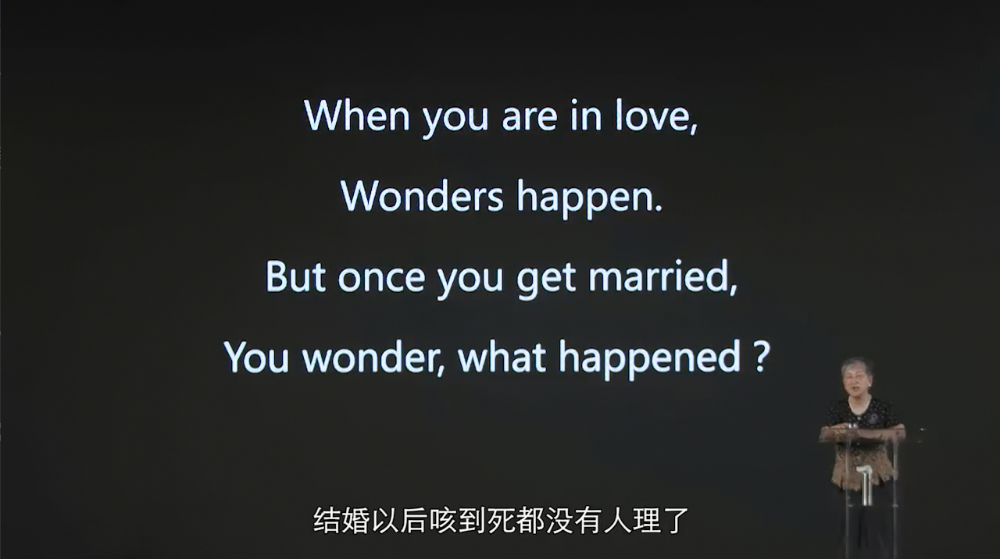

#  认知心理学——混沌大学

# 快思慢想

每天早上起来用系统2回忆昨天做的决定是不是系统1快速做出的。

## 框架效应

*面对同一问题，问题表达方式不同，人们最终的选择不同。*

一般来说框架效应随着年龄增长而增加，使用**第二语言时消失**。

碰到重大决定的时候，*Sleep on it. 隔夜，想一想再做决定。*

## 锚定效应和调整不足

*人们用已知信息作为基准点，调整的幅度不会太多。*

# 认知神经科学

## 大脑神经元的链接

可以通过**主动地**训练让特定的神经连接变得更加多、粗。

# 情绪与决策

## 发展关键期

自我控制：“情绪是认知对情景的解释”。可以通过改变心态，改变看待问题的方式来改变自己的情绪。

## 具身认知

身体也参与到认知活动中的现象。

如：

- 身体上感到重的时候，认为眼前的物品更加重要。
- 口中有甜食的时候，心情更好。
- 相比歪着坐，挺直坐的时候成就感更高。

## 意识与潜意识

*自由意志可能是个错觉。*大脑中存在解释者，将我们的行为合理化。

理智和情感并不是对立的。有感情的时候理智才能做判断。

# 大脑与沟通——男女有别

## 大脑结构不同

男脑胼胝体较薄，前后链接多——适合专心工作；女脑胼胝体较厚，左右连接多——适合一心多用。

男在空间能力上更好，女在语言能力上更好——能听出语调中的微妙变化。

### 情绪管理，表达方式，沟通方式不同

女性更能记住情感性的事件的细节。