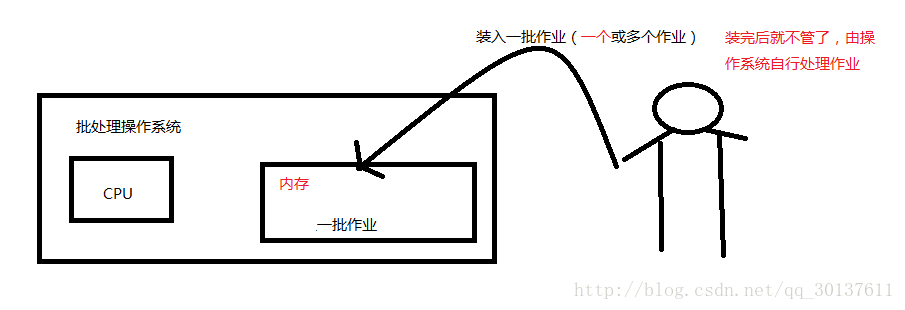
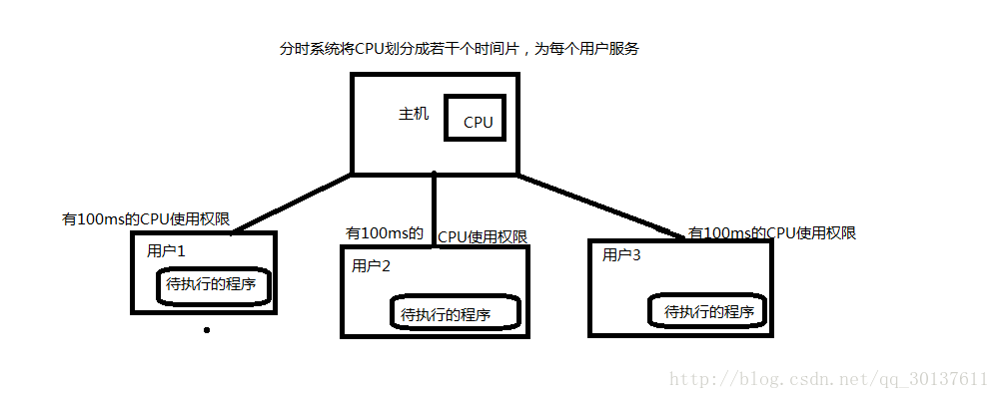

# 操作系统-NJU

[TOC]

## Process

 **Q**

-   原语primitive=>原子操作atomic action
    -   是由若干个机器指令构成的完成某种特定功能的一段程序，具有不可分割性·即原语的执行必须是连续的，在执行过程中不允许被中断。
-   程序性中断=>异常？

Linux下的三种Schedule机制

1.  Tasklet
2.  Softirq
3.  Workqueue

## Sync

**Q**

-   周转时间和响应时间

    -   >   响应时间：从提交第一个请求到产生第一个响应所用时间。
        >   周转时间：从作业提交到作业完成的时间间隔。
        >   平均周转时间：衡量不同调度算法对相同作业流的调度性能。
        >   带权周转时间：反映长短作业的差别。
        >   平均带权周转时间：比较某种算法对不同作业流调度性能。
        >   举例说明：
        >   比如你让我回答:100加100加100加100减100等于多少? 我用2秒回答了你等于300 那么我要计算你这个问题是要时间的我花了1.8秒来运算就是周转时间. 总共用了2秒准确地回答了你的问题就是响应时间. 计算过程是周转时间.接到命令到计算出答案就是响应时间.

-   

**上课要注意的点**

-   简单地描述各类调度算法
-   能人肉模拟调度过程

### 临界区管理

-   软件 Peterson算法 要进和已经进（虽然好像也没有写得很及时？）
-   硬件
    -   关中断
    -   指令
        -   Test & Set
        -   Swap
-   *Q：具体操作？*

### Sync机制

PV操作和信号量

*Q：看OS162吧。*

### IPC（进程间通信）

-   信号通信机制
-   管道
-   共享内存

### 死锁

-   Prevention-4 Prop
-   Aviodence-Banker
-   Detect & Recovery

# 名词解释

### 分时系统

>   要弄清批处理系统和分时系统的区别，首先我们得了解何为批处理系统和分时系统？ 
>   一、批处理系统 
>   从字面上理解，就是一批一批的处理任务的一种系统，严格的定义，就是指用户将一批作业提交给操作系统后就不再干预，由操作系统控制它们自动运行。这种采用批量处理作业技术的操作系统称为批处理操作系统。简单地理解就是我手中有一大堆作业（相当一个程序）要运行，我一个一个的放入内存中执行效率会很慢，因为我要人为的去装载程序（早期的机器会把程序写到磁带中，然后人为地放到专门处理程序的机器中），**所以我一次性放一批的作业，让操作系统自己去运行它，而我不需要干涉，这样我就省了很多力气。**
>   
>
>   
>
>   二、分时系统 
>   分时操作系统：“分时”的含义是指多个用户使用同一台计算机，多个程序分时（分时间片）共享硬件和软件资源。分时操作系统是指在一台主机上连接多个带有显示器和键盘的终端，同时允许多个用户通过主机的终端，以交互方式使用计算机，共享主机中的资源。**分时操作系统将CPU的时间划分成若干个片段，称为时间片，操作系统以时间片为单位，轮流为每个终端用户服务。**
>
>   
>
>   从他们的定义我们大概可以总结出： 
>   批处理系统没有人机交互，而分时系统允许多个用户同时使用 
>   批处理系统中允许程序长时间地占用CPU，而分时系统不允许 
>
>   问题：多道程序按不按时间片来分配时间 
>   不按，时间片时在分时系统中提出的概念，多道程序没有时间片的概念

### 可重入代码

>   可重入代码(Reentry code)也叫纯代码(Pure code)是一种**允许多个进程同时访问的代码。**为了使各进程所执行的代码完全相同，故不允许任何进程对其进行修改。**程序在运行过程中可以被打断，并由开始处再次执行，并且在合理的范围内（多次重入，而不造成堆栈溢出等其他问题），程序可以在被打断处继续执行，且执行结果不受影响。**

### 可重入函数

>   可重入函数主要用于多任务环境中，一个可重入的函数简单来说就是**可以被中断的函数**，也就是说，**可以在这个函数执行的任何时刻中断它，转入OS调度下去执行另外一段代码，而返回控制时不会出现什么错误**；而不可重入的函数由于使用了一些系统资源，比如全局变量区，中断向量表等，所以它如果被中断的话，可能会出现问题，这类函数是不能运行在多任务环境下的。